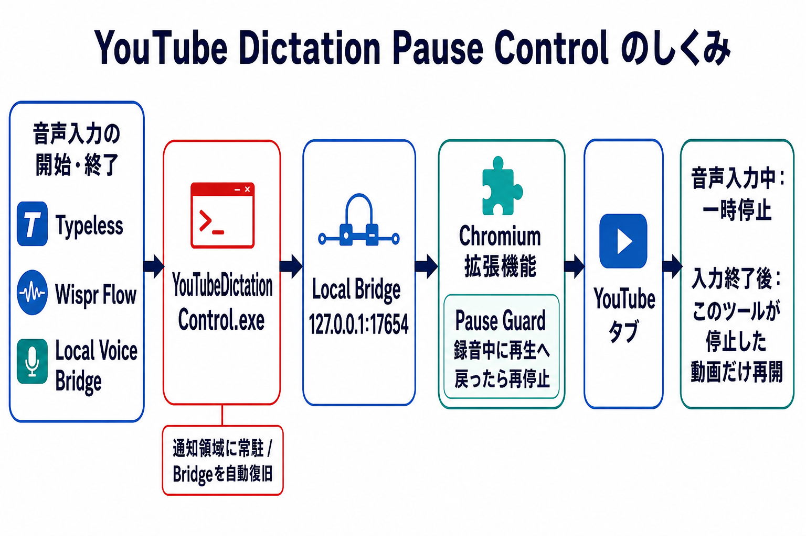

# YouTube Dictation Pause Control

[](https://github.com/misaka310/youtube-dictation-pause-control/actions/workflows/ci.yml)
[](https://github.com/misaka310/youtube-dictation-pause-control/releases/latest)

Windowsで音声入力中だけYouTubeを自動一時停止するローカル補助ツールです。通知領域常駐EXEがTypeless／Wispr Flowの操作を検知し、対応するLocal Voice Bridgeは録音状態をローカルHTTP Bridgeへ直接通知します。BraveなどのChromium系ブラウザのYouTubeタブだけを制御します。

> **非公式・非提携について**
> このプロジェクトは独立して開発された非公式ツールであり、Google、YouTube、Typeless、Wispr Flowの公式製品、提携製品、承認製品、スポンサー製品ではありません。各製品名・サービス名・商標は各権利者に帰属します。

配布ZIPにはAutoHotkey v2ランタイムを組み込んだ`YouTubeDictationControl.exe`とNode.jsランタイムが含まれるため、利用者がAutoHotkeyやNode.jsを別途インストールする必要はありません。

<p align="center">
  
</p>

## 動作デモ

https://github.com/user-attachments/assets/a8541fb9-1728-41ec-9533-6d8fb5dd342b

`Ctrl + ]`で音声入力を開始すると動画が停止し、もう一度押して終了すると再開する流れを確認できます。画面は操作説明用に作成したUIです。

## できること

- 音声入力開始時に、再生中だったYouTube動画を一時停止
- 音声入力終了時に、このツールが停止した動画だけを再開
- 録音中に再生へ戻った場合はPause Guardで再停止
- Typeless、Wispr Flow、対応版Local Voice Bridgeの入力状態を統合
- YouTubeのSPA遷移や拡張機能再読み込み後も再接続
- 通知領域へ常駐し、通常利用ではターミナルを表示しない
- Bridge終了時の自動復旧とWindowsログイン時の自動起動

## 必要なもの

- Windows 10 / 11（x64）
- Brave BrowserまたはChromium系ブラウザ

**配布版の利用にNode.jsとAutoHotkeyのインストールは不要です。** ソースから開発・テストする場合はNode.js 22以上が必要です。

## セットアップ

### 1. 配布ZIPを展開する

[Latest Release](https://github.com/misaka310/youtube-dictation-pause-control/releases/latest)から`YouTubeDictationPauseControl-<version>-windows-x64.zip`を取得し、書き込み可能なフォルダへ展開します。各ReleaseにはZIPと`SHA256SUMS.txt`が添付されます。

### 2. 拡張機能を読み込む

1. Braveで`brave://extensions`を開きます。
2. デベロッパーモードをオンにします。
3. 「パッケージ化されていない拡張機能を読み込む」から、展開先の`extension`フォルダを選びます。

### 3. 常駐アプリを起動する

`YouTubeDictationControl.exe`をダブルクリックします。Windows右下の通知領域にアイコンが表示され、同梱Node.jsで`127.0.0.1`専用Bridgeをウィンドウ非表示で起動します。

### 4. 動作確認

1. BraveでYouTube動画を再生します。
2. Wispr Flowは`Ctrl + ]`、Typelessは`Ctrl + [`で音声入力を開始します。
3. 対応版Local Voice Bridgeでは、右Ctrlを押したまま右Shift左の`＼ / _`キーを押している間だけ録音します。
4. 動画が停止し、入力終了後に再開することを確認します。

詳細な実機確認は[`docs/e2e-checklist.md`](docs/e2e-checklist.md)を参照してください。

## 通知領域メニュー

- `Status: ...`: Bridgeの現在状態
- `Restart local bridge`: このEXEが所有するBridgeを再起動
- `Reset dictation state`: 音声入力状態をinactiveへ戻す
- `Open recent activity` / `Open full log`: 状態変化やエラーを確認
- `Start with Windows`: 現在のユーザーの自動起動を切り替え
- `Exit`: 常駐アプリと所有中のBridgeを終了

既に別の互換Bridgeが起動している場合、そのプロセスを勝手に停止しません。

## 状態が逆になったとき

Typeless / Wispr Flowを停止し、Local Voice Bridgeの録音キーを離してから`Ctrl + Alt + R`を押すか、通知領域の`Reset dictation state`を選びます。この操作は音声入力アプリ本体を停止しないため、入力終了後に使用してください。

## 設定

設定を変更しない場合、`config/settings.json`は不要です。Typeless / Wispr Flowのホットキーには通常キーを1つ含めてください。`Ctrl + Shift`のような修飾キーだけの組み合わせは使えません。ポート、ホットキー、復旧用キー、自動起動などを変更する場合は[設定リファレンス](docs/configuration.md)を参照してください。

## プライバシーとセキュリティ

- 外部サーバーへ音声や入力内容を送信しません
- ローカルHTTP Bridgeは`127.0.0.1`のみにバインドします
- APIキー、OAuthトークン、認証情報は使いません
- 実行ログとPIDはローカルへ保存し、Git管理外です
- ローカルポートを外部ネットワークへ公開しないでください
- CORSは拡張機能Origin向けに制限しています

詳しくは[`SECURITY.md`](SECURITY.md)を参照してください。

## 制限

- YouTube側のDOM変更やブラウザ仕様変更で動作しなくなる場合があります
- 拡張機能が無効または未読込のタブは制御できません
- このツールが一時停止していない動画は、入力終了時に再開しません
- Pause GuardはすべてのYouTube UI状態で完全な停止維持を保証するものではありません
- Typeless / Wispr Flowの状態はホットキー押下をトグルとして扱います

## 開発・配布資料

```cmd
npm test
```

- 状態と再生制御: [`docs/state-behavior.md`](docs/state-behavior.md)
- Windows GUI検証: [`docs/windows-gui-testing.md`](docs/windows-gui-testing.md)
- 公開前チェック: [`docs/public-release-checklist.md`](docs/public-release-checklist.md)
- Release手順: [`docs/releasing.md`](docs/releasing.md)（`vX.Y.Z`タグで自動公開）
- 旧Native Messaging検討記録: [`docs/legacy-native-messaging.md`](docs/legacy-native-messaging.md)

## License

このリポジトリ独自のソースコードはMIT Licenseです。配布版に含まれるAutoHotkeyとNode.jsには各ライセンスが適用されます。詳細は[`THIRD_PARTY_NOTICES.md`](THIRD_PARTY_NOTICES.md)を参照してください。
